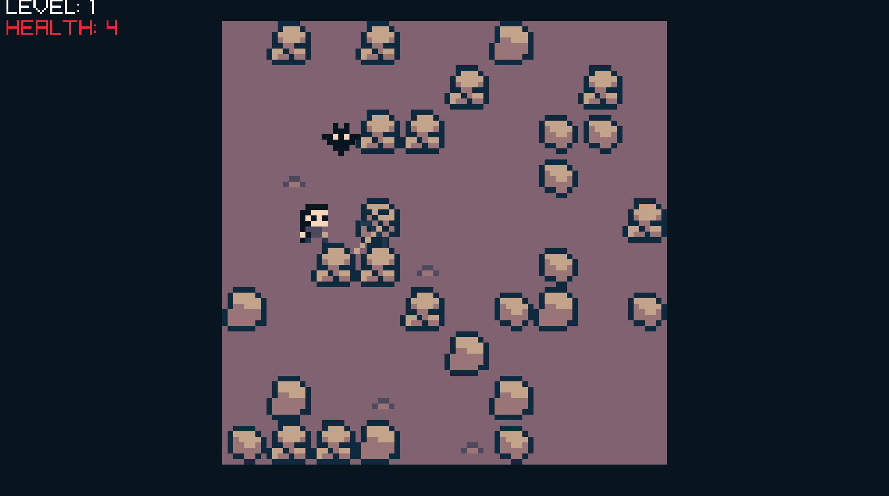

# Deep Descent

Game about descending deeper into the cave you are stuck in. There is no official end to the game.
Try to go as deep as you can. 

## About
The whole purpouse of the project was a challange to myself. I just wanted to make something and have it finished. All of my projects up until now have not
even been close to finished. For that reason i wanted to challange myself to make something start to finish.

The time frame was a week during the second part of the winter break. During that time I only worked on it for about 2 to 3 days. Due to health reasons
I could not work on the game for the rest of the week.
Because of that the time frame was changed from 1 week to 2 weeks and started after the winter break.

The game may not be super polished but the core functionality is done so I consider it finished. I consider having something finished but a little crappy
being more valuable then having something good looking but half baked and never seeing the light of day.

## Build
The game is build using Visual studio 2022 and raylib. Raylib is not included in any folder so you'll have to link it yourself. 
I installed it via vcpkg and it works for me.
In the future there are plans to implement a proper build system like cmake. 
